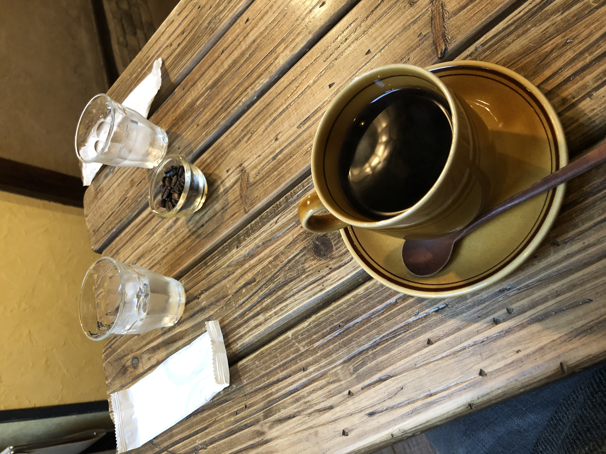
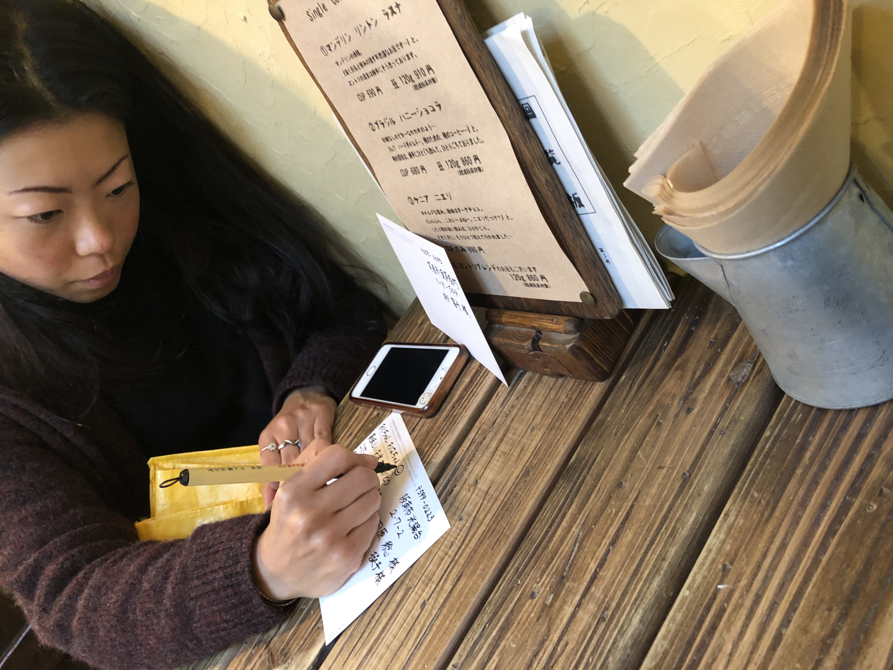
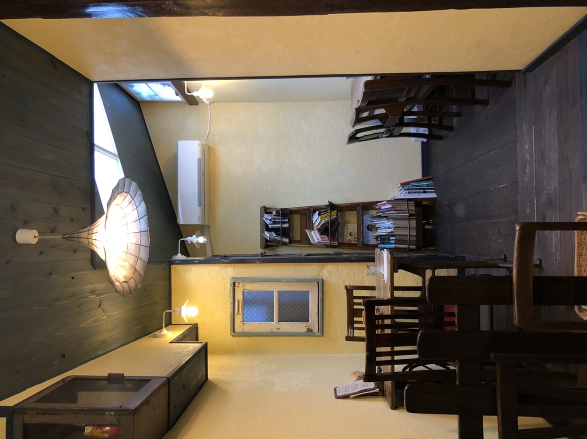
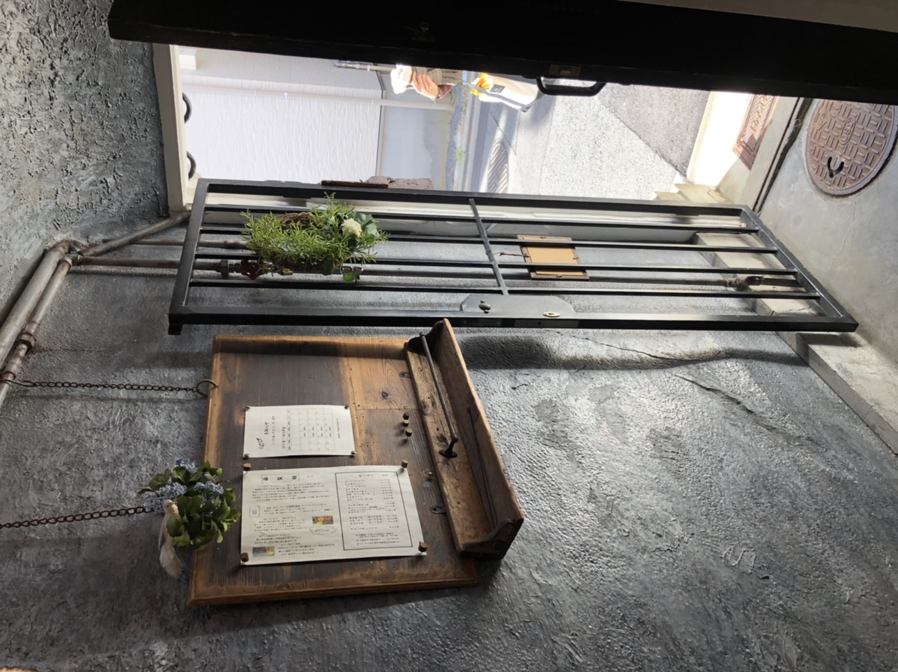
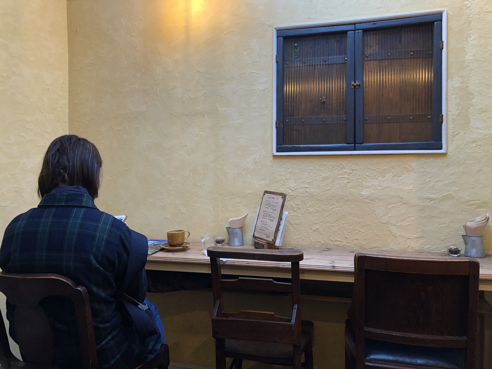
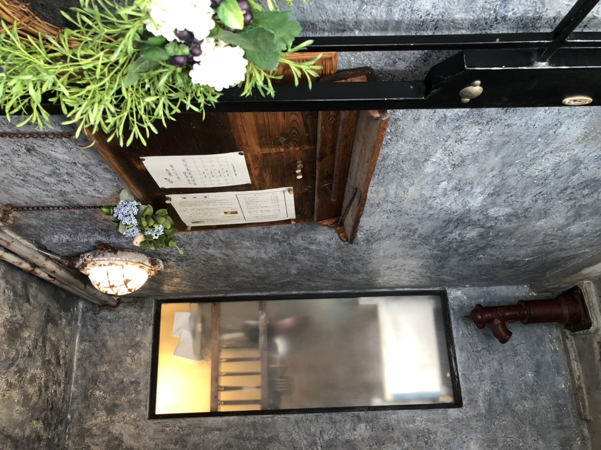
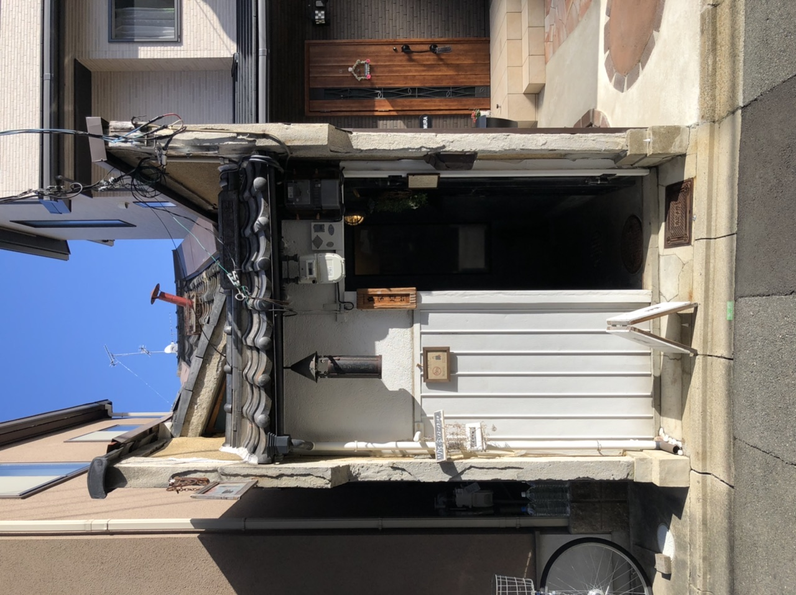
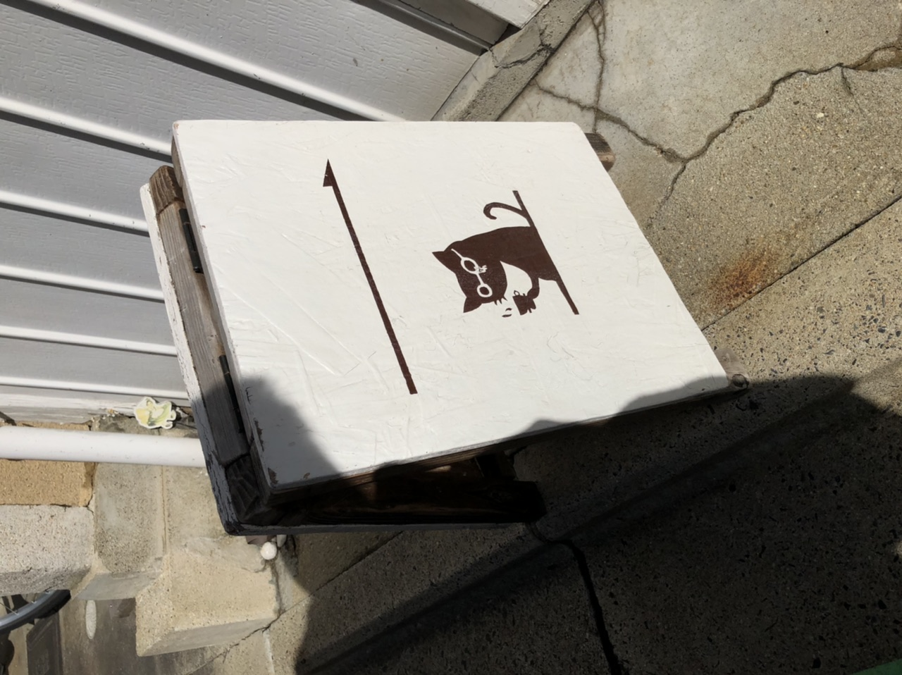
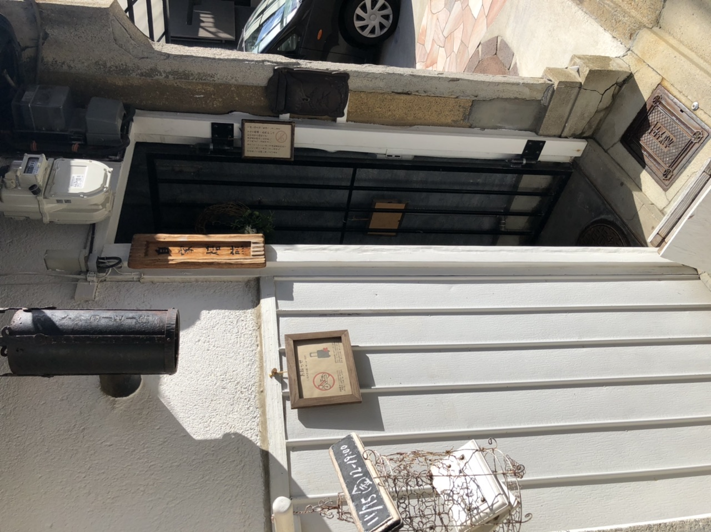

---

type: "post"
title: "Café Entotsu House (ヱントツコーヒー)"
author: "Bearandchi"
category: "review"
date: "2020-02-15"
slug: "/cafe-entotsu-house"
postImage: "./img/cafe-entotsu-house/3514FAAB-401C-4063-A0DD-3336E5C9DDD1.jpeg"
metaDescription: "For this Coffee-Sunday we have been to Café Entotsu which is a small café but very well designed café in Kyoto, Japan.  Here's how we found it!"

---

## Our Rating:
*Coffee:* ⭐️⭐️⭐️⭐️⭐️ 
*Atmosphere:* ⭐️⭐️⭐️⭐️ 
*Staff:* ⭐️⭐️⭐️ 
*Money value:* ⭐️⭐️⭐️ 
*Menu:* ⭐️⭐️⭐️⭐️

---

## Our Comment:

We came at 12:30pm soon after the cafe opened for the day, but the lady of the cafe owner was already very rushed and explained the rules of the cafe in a rushed manner. We did not feel very welcomed when we entered and also when we were choosing our orders.  
Apart from us there was one other young japanese lady having coffee and she as well pressured by the café lady to choose her order quickly. The actual owner though is very calm and when he served us the coffees, we felt his strong pleasure towards making each coffee from the bottom of his heart. The coffees tasted great but not outstanding for what you pay (¥600 for a blend coffee & ¥680-690 for a single origin coffee).  
The cafe itself was quite cold already, and as there was no heating when we were there, it made the cold coffee feel even worse... The atmosphere inside the cafe felt cold, as we were told not to speak out loud, even though there were really no other guests. If the staff were more welcoming, surely the overall atmosphere of the cafe would have been nicer. In the end we paid ¥600 each for a decent taste, but cold coffee and left after 20mins 'cause of the quite unwelcoming atmosphere. We say this rarely, but this café was really a miss.  
Another inconvenience was that inside the café you aren't really allowed to take any photos as well as there is no car or bicycle parking... So I guess you should only walk there? 

---

## Address:
ヱントツコーヒー舎 (Café Entotsu House) 
〒602-8314 京都府京都市上京区佐竹町110-2 
110-2 Satakecho, Kamigyo Ward, Kyoto, 602-8314 
[https://goo.gl/maps/CdZhzsz3inwuQukV7](https://goo.gl/maps/CdZhzsz3inwuQukV7)

---

## Our Photos:

