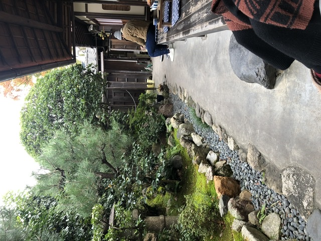
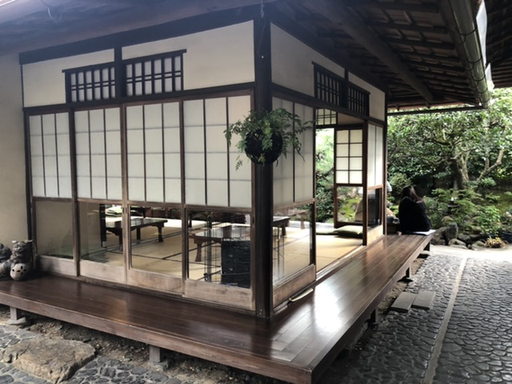
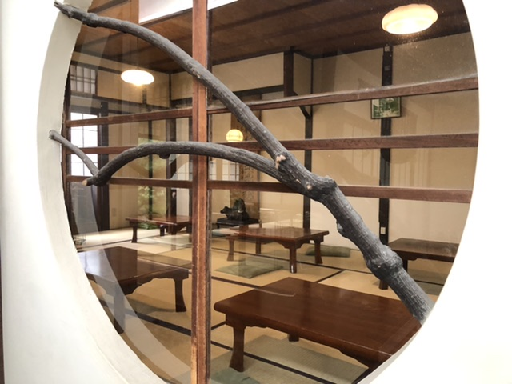
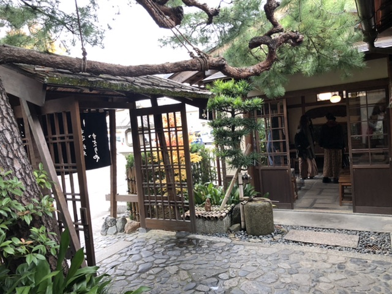
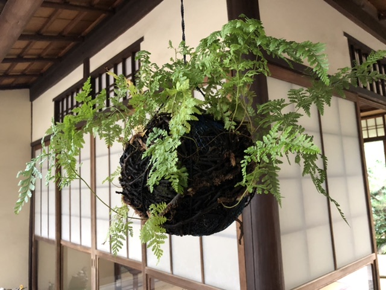
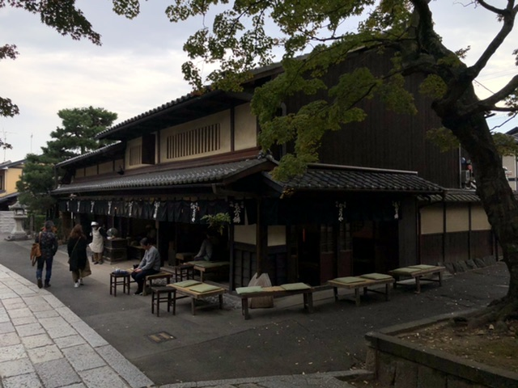
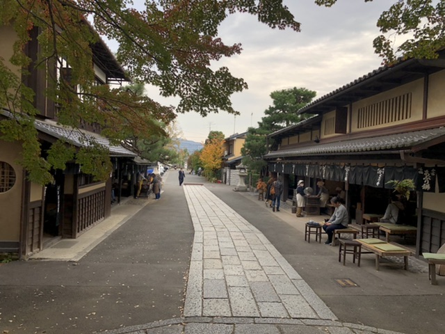

---

type: "post"
title: "Kazariya - Aburi-mochi"
author: "Bearandchi"
category: "review"
date: "2020-02-14"
slug: "/kazariya-aburi-mochi"
postImage: "./img/kazariya-aburi-mochi/2B2F8899-B962-4154-BCE5-B588EEE9F153.jpeg"
metaDescription: "Kazariya is 'the place' to go to in Kyoto for Aburimochi ('roasted rice cake'). The Aburi-mochi shop is located right next to Imamiya Shrine, and just a 5min walk from the famous Zen temple-complex Daitokuji."

---

## Our Rating:
*Coffee:* ⭐️⭐️⭐️⭐️⭐️ 
*Atmosphere:* ⭐️⭐️⭐️⭐️⭐️ 
*Staff:* ⭐️⭐️⭐️⭐️⭐️ 
*Money value:* ⭐️⭐️⭐️⭐️⭐️ 
*Menu:* ⭐️⭐️⭐️

---

## Our Comment:

Kazariya is 'the place' to go to in Kyoto for Aburimochi ('roasted rice cake'). The Aburi-mochi shop is located right next to Imamiya Shrine, and just a 5min walk from the famous Zen temple-complex Daitokuji. The shop is quiet and staff is amazingly welcoming. Not many foreigners to be seen around there. You get an Aburi-mochi set (12 pieces) with tea for ¥500, which you can share with 2 people as well. If you get to Daitokuji I highly recommend coming here as well.

---

## Our Photos:

---

## Address:

〒603-8243 京都府京都市北区紫野今宮町96 
96 Murasakino Imamiyacho, Kita Ward, Kyoto, 603-8243, Japan 
[https://goo.gl/maps/c8XdBWgN5UxcfXHbA](https://goo.gl/maps/c8XdBWgN5UxcfXHbA)